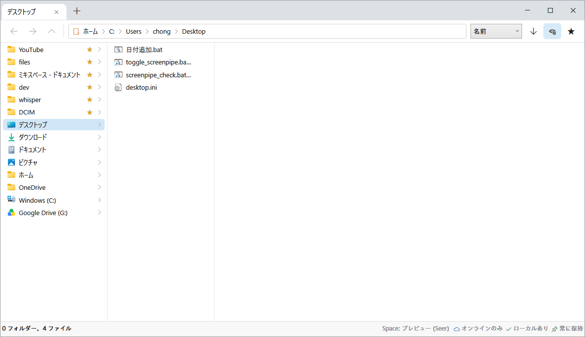

# Column View

macOS Finder のカラム表示（Miller columns）を Windows で再現する軽量ファイルブラウザー。

Files アプリが重い、でも標準エクスプローラーにはカラム表示がない——その隙間を埋めるための最小構成アプリです。



## 機能

- **カラム表示** — フォルダをクリックすると右に列が伸びていく Finder 流ナビゲーション
- **クイックプレビュー** — `Space` で装飾なしのプレビューをポップアップ表示（macOS Finder の Quick Look 相当）。タイトルバーも枠も無く、中身だけを角丸で表示。開いたまま選択を変えると追従します
  - 画像はそのまま、動画・音声は再生（ホバーでシークバー）、テキスト／コードは中身を表示。それ以外（PDF・Office 等）はシェルの大サムネイルにフォールバックするので、**ほぼ全形式**に対応
  - プレビュー中も列のキー操作は生きたまま（↑↓ で選択を移すとプレビューが追従、`Space`/`Esc` で閉じる）
- **サムネイル表示** — 画像・動画・PDF・Office などは行アイコンに実サムネイルを表示（エクスプローラーと同じ `IShellItemImageFactory`）。表示中の行だけをバックグラウンドで取得し、キャッシュ済みのみ読むのでクラウド実体のダウンロードは誘発しません
- **クラウド状態表示** — ファイル属性を読み、エクスプローラー同様の状態を表示
  - ☁ オンラインのみ / ✓ ローカルにあり / 📌 常にこのデバイスに保持
  - 属性ベースの判定なので、オンライン専用ファイルのダウンロードを誘発しません
  - **OneDrive だけでなく Google ドライブ・Nextcloud・Dropbox など Cloud Files API を使う全プロバイダに対応**（`SyncRootManager` から同期ルートとプロバイダ名を検出してホーム列に表示、ツールチップにプロバイダ名も表示）
  - 右クリックの「**常にこのデバイスに保持**」「**オンラインのみにする（空き容量を増やす）**」で、ファイル／フォルダ単位のオフライン保持を切替（フォルダは再帰）。ピン属性を書くだけなので各クライアントの設定とそのまま同期します
- **タブ** — `Ctrl+T` 新規タブ / `Ctrl+W` タブを閉じる
- **並べ替え** — 名前 / 更新日時 / サイズ / 種類 × 昇順 / 降順（既定: 名前降順、フォルダ優先）。設定は自動保存
- **お気に入り** — ツールバーの ★ または右クリックメニューでフォルダを登録。ホーム列に表示
- **タブグループ** — よく使うフォルダの組合せを 1 つのグループにまとめる（Chrome のタブグループ相当）
  - **クリックで中身を次のカラムに展開**（Finder 流のドリルイン）。**入れ子（サブグループ）**にも対応し、ホーム列が散らからない
  - 右クリックで「**すべてタブで開く（サブグループ含む）**」「**直下のフォルダのみ開く**」、現在のフォルダを追加、新しいサブグループ、別のグループへ移動、名前変更、削除
  - 作成はツールバーの ▦ ボタンから（空 / 現在のフォルダ / 開いているタブすべて）。フォルダを追加するには、見出しへのドラッグ＆ドロップ・▦ ボタンの「現在のフォルダを追加」・右クリックのいずれか
  - **お気に入りとグループはホーム列で同列に並べ替え可能**。グループ／メンバーはドラッグで並べ替え、グループ同士は中央にドロップで入れ子化（どの階層でも同じ操作）
  - 設定（`settings.json`）に保存（一意 ID で階層管理）
- **右クリックメニュー** — Windows 本物のシェルコンテキストメニュー（`IContextMenu`）。切り取り・コピー・貼り付け・削除・名前の変更・送る・プロパティ・以前のバージョン…に加え、PowerToys や OneDrive などインストール済みシェル拡張もそのまま表示。末尾に独自の「お気に入りに追加/削除」「パスをコピー」、クラウド項目には「常にこのデバイスに保持 / オンラインのみにする」を追加
- **Chrome 風のタブ** — タイトルバーを排し、タブをウィンドウ最上段に配置
  - タブを横にドラッグ → タブ列内で並べ替え
  - 複数タブのうち1枚を下にドラッグ → 別ウィンドウに切り離し（ウィンドウがカーソルに追従し、最前面・半透明で表示）
  - タブ1枚だけのウィンドウはタブを掴むとウィンドウごと移動
  - 別ウィンドウのタブ列に重ねて離すと再結合（重ねた先が青く強調、ドラッグ中のウィンドウは透けて相手が見える）
- **パンくずアドレスバー** — 各階層をクリックでジャンプ。余白クリックまたは `Ctrl+L` でパス直接入力に切替
- **個別ファイルアイコン** — `.exe` の埋め込みアイコンなど実アイコンをバックグラウンドで読み込み（クラウド専用ファイルはダウンロード回避のため汎用アイコン）
- **複数選択** — `Ctrl`/`Shift`+クリックで複数選択し、まとめてドラッグ移動
- **エクスプローラー風の全体 UI** — 戻る/進む/上へボタン（`Alt+←/→/↑`）、Win11 風の角丸ハイライト
- **ドラッグ&ドロップ** — 列の項目を別フォルダ・他アプリ・エクスプローラーへドラッグ。外部からの取り込みも可
  - 同一ドライブ内は移動、別ドライブはコピー（`Ctrl`=コピー / `Shift`=移動で上書き）
  - 進捗・上書き確認は Windows 標準ダイアログを使用（エクスプローラーと同じ操作感）
  - ドロップ先フォルダは青くハイライト
- **エクスプローラー風 UI** — Windows 11 と同じ角丸の選択ハイライト・ホバー表示
- **キーボードのファイル操作** — `Ctrl+C` コピー / `Ctrl+X` 切り取り / `Ctrl+V` 貼り付け / `Del` ごみ箱へ / `Shift+Del` 完全削除 / `F2` 名前変更 / `Ctrl+Shift+N` 新しいフォルダ
  - クリップボードはエクスプローラー互換 (`CF_HDROP` + Preferred DropEffect)。ColumnView でコピーしてエクスプローラーへ貼り付け (逆も) が可能
  - **切り取った項目は半透明**、コピーした項目はクリップボードのバッジで表示。他アプリがクリップボードを使ったら自動で戻り、`Esc` でも取り消せる
  - 同じフォルダへのコピー貼り付けは「◯◯ - コピー」を作成 (エクスプローラーと同じ)
  - 削除の確認・進捗は Windows 標準ダイアログ (複数選択も 1 回の操作にまとめて処理)
  - `Ctrl+Z` で直前の操作を取り消し、`Ctrl+Shift+Z` / `Ctrl+Y` でやり直し (名前変更 / 移動 / コピー / 新しいフォルダ / 削除。履歴 20 件・全ウィンドウ共有)
  - **ごみ箱の無い場所 (NAS・ネットワークドライブ・USB) の削除も取り消し可能** — 同じボリューム上の隠しフォルダ `.ColumnViewTrash` へ移動する退避方式 (データ転送なしで一瞬)。退避先を作れない共有では完全削除せず中止する (`Shift+Del` で明示的に完全削除)
    - 属性は Hidden+System (Windows からはほぼ不可視、Mac/Linux にはドット名で隠れる)
    - 自動掃除は**アプリ起動時と削除時**に実行。保持 30 日 (`TrashRetentionDays` で変更可)。取り消しで空になった世代は即掃除
    - 退避を使いたくない場合は `settings.json` の `UseAppTrash: false` で「シェルの警告付き完全削除」に切替可 (取り消し不可になる)
  - `Ctrl+Shift+N` で作ったフォルダは自動で選択され、すぐ中に入れる
- **フォルダの自動更新** — 表示中の列を `FileSystemWatcher` で監視し、外部での作成・削除・名前変更や OneDrive の状態変化を自動反映 (500ms に 1 回へ間引いて軽量)
- **タイプアヘッド検索** — 列にフォーカスして名前を打つと先頭一致で選択がジャンプ (エクスプローラー / Finder と同じ)
- **セッション復元** — 最後に閉じたウィンドウのタブ構成を保存し、次回起動時に各フォルダを開き直す (`settings.json` の `RestoreSession: false` で無効化)
- **軽量** — 列挙はディレクトリ走査のみ、アイコンは拡張子単位キャッシュ、リストは仮想化

設定とお気に入りは `%APPDATA%\ColumnView\settings.json` に保存されます。

## キーボードショートカット

| キー | 動作 |
|---|---|
| `Space` | クイックプレビュー（トグル） |
| `Enter` | 選択項目を開く |
| `→` | 選択フォルダの列へ移動 |
| `←` / `Backspace` | 親の列へ戻る |
| 文字入力 | 名前の先頭一致で選択ジャンプ |
| `Ctrl+C` / `Ctrl+X` / `Ctrl+V` | コピー / 切り取り / 貼り付け |
| `Esc` | コピー / 切り取りの取り消し |
| `Del` / `Shift+Del` | ごみ箱へ / 完全削除 |
| `F2` | 名前の変更 |
| `Ctrl+Z` / `Ctrl+Shift+Z` (`Ctrl+Y`) | 元に戻す / やり直し |
| `Ctrl+Shift+N` | 新しいフォルダ |
| `Ctrl+T` / `Ctrl+W` | タブを開く / 閉じる |
| `Ctrl+H` | 隠しファイルの表示切替 |
| `Ctrl+L` | パスバーへフォーカス |
| `Alt+←` / `Alt+→` / `Alt+↑` | 戻る / 進む / 上へ |
| `Ctrl`/`Shift`+クリック | 複数選択 |
| タブを下にドラッグ | 別ウィンドウに切り離し |

## ビルド

.NET 8 SDK が必要です。

```powershell
dotnet build -c Release          # 開発ビルド
dotnet publish -c Release -r win-x64 --self-contained -p:PublishSingleFile=true -o publish
```

`publish\ColumnView.exe` は .NET ランタイム不要の単体実行ファイルです。

## 既知の制限 (v0.5)

- 右クリックは Windows の「従来の（クラシック）」コンテキストメニュー。Windows 11 の新しい簡易メニューはエクスプローラー専用のため第三者アプリからは表示できない（クラシックメニューの方が項目は多い）
- フォルダ自体のクラウド状態は OneDrive が属性を付けた場合のみ表示
- タブのドラッグは「並べ替え」「別ウィンドウへの切り離し」「別ウィンドウへの再結合」に対応
